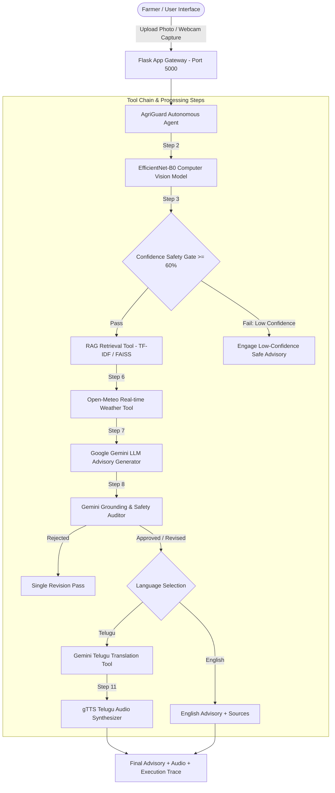

# AgriGuard AI — Intelligent Crop Disease Diagnosis and Advisory Agent

[](https://www.python.org/)
[](https://pytorch.org/)
[](https://torchvision.readthedocs.io/)
[](https://ai.google.dev/)
[]()

> **Final Academic Project**: An evidence-grounded multi-tool AI Agent orchestrating computer vision disease screening, safety confidence thresholding, Retrieval-Augmented Generation (RAG), real-time weather context, Google Gemini LLM advisory generation, grounding validation, and Telugu audio synthesis.

---

## 1. System Architecture



---

## 2. Key Capabilities & AI Agent Workflow

AgriGuard AI is **not a simple chatbot**. It operates as an **autonomous multi-tool agent** following a strict 12-step trace workflow:

1. **Farmer Input Gateway**: Accepts crop leaf images via photo upload or live webcam camera capture.
2. **EfficientNet-B0 Prediction**: Evaluates 224x224 RGB image with pretrained ImageNet feature extractor + custom classifier head.
3. **Confidence Safety Gate**: Enforces a strict 60% confidence threshold. Low confidence halts specific disease claims and provides safe screening fallbacks.
4. **RAG Knowledge Retrieval**: Queries a structured agricultural knowledge base using TF-IDF cosine similarity.
5. **RAG Evidence Verification**: Validates relevance scores and attaches evidence chunks to the advisory prompt context.
6. **Open-Meteo Weather Tool**: Fetches real-time temperature, humidity, and precipitation for regional weather risk correlation.
7. **Google Gemini LLM Advisory Generator**: Generates evidence-grounded JSON advisory using `gemini-2.5-flash` via the Google GenAI SDK.
8. **Gemini Safety & Grounding Auditor**: Runs an independent Gemini audit checking diagnostic uncertainty, absence of unverified pesticide dosages, and source compliance.
9. **Revision Loop**: Triggers automated revision if safety audit fails.
10. **Telugu Translation**: Translates advisory to farmer-friendly Telugu preserving all safety warnings.
11. **Telugu Speech Synthesis**: Synthesizes spoken Telugu MP3 audio using gTTS for voice-first farmer accessibility.
12. **Agent Execution Trace**: Records and renders an interactive timeline of all tool invocations and step timestamps.

---

## 3. Supported Crop Disease Classes (10)

The computer vision model is trained strictly on 10 closed-set dataset classes:

| Crop | Disease / Health Status | Class Identifier |
| :--- | :--- | :--- |
| **Tomato** | Early Blight | `Tomato___Early_Blight` |
| **Tomato** | Late Blight | `Tomato___Late_Blight` |
| **Tomato** | Leaf Mold | `Tomato___Leaf_Mold` |
| **Tomato** | Healthy | `Tomato___Healthy` |
| **Corn / Maize** | Gray Leaf Spot | `Corn___Gray_Leaf_Spot` |
| **Corn / Maize** | Common Rust | `Corn___Rust` |
| **Corn / Maize** | Healthy | `Corn___Healthy` |
| **Rice** | Rice Blast | `Rice___Blast` |
| **Rice** | Brown Spot | `Rice___Brown_Spot` |
| **Rice** | Healthy | `Rice___Healthy` |

*Closed-set Limitation Note: The model does not diagnose unsupported classes (e.g. Septoria on tomato) or unmapped diseases.*

---

## 4. Technology Stack

- **Core Framework**: Python 3.9+, Flask, HTML5/CSS3/JavaScript
- **Computer Vision**: PyTorch, Torchvision, EfficientNet-B0
- **LLM & Safety Auditor**: Google Gemini (`google-genai` SDK, `gemini-2.5-flash`)
- **Knowledge Retrieval (RAG)**: scikit-learn TF-IDF Vectorizer & Cosine Similarity
- **Weather API**: Open-Meteo Free Forecast & Geocoding API
- **Speech Synthesis**: gTTS (Google Text-to-Speech, `lang="te"`)
- **Data & Metric Utilities**: Pillow, NumPy, scikit-learn classification report & confusion matrix

---

## 5. Model Restoration & Persistence

AgriGuard AI features a persistent **resumable model restore system**:
- Search Order: `/content/drive/MyDrive/AgriGuard_AI/models/` -> `models/`
- Target Checkpoints: `agriguard_efficientnet_b0.pt`, `best_classifier.pt`, `class_map.json`
- Function `load_saved_model()` automatically restores architecture size, weights, and CUDA device state.
- **Runtime restarts in Google Colab will not destroy trained weights.**

---

## 6. Installation & Execution

### Prerequisites
Set your Google Gemini API key:
```bash
export GEMINI_API_KEY="your_actual_gemini_api_key"
```

### Local Setup
1. Clone / extract project repository.
2. Install dependencies:
```bash
pip install -r requirements.txt
```
3. Start AgriGuard AI Web Application:
```bash
python app.py
```
4. Open browser at: `http://localhost:5000`

---

## 7. Project Structure

```
AgriGuard_AI/
├── app.py                   # Main Flask Web Application (Port 5000)
├── requirements.txt         # Project Dependencies
├── README.md                # Complete Academic Documentation
├── .env.example             # Environment Configuration Template
│
├── agent/
│   ├── __init__.py
│   └── agriguard_agent.py   # 12-Step Autonomous AI Agent Orchestrator
│
├── ml/
│   ├── __init__.py
│   ├── model.py            # EfficientNet-B0 PyTorch Architecture
│   ├── dataset.py          # Dynamic Folder Mapper & Data Loader
│   ├── train.py            # 2-Stage Transfer Learning & Metrics
│   ├── predict.py          # Prediction & Confidence Gate Logic
│   └── class_map.json      # 10 Supported Classes Definition
│
├── rag/
│   ├── __init__.py
│   ├── knowledge_base.py   # Temporary Agricultural Knowledge Entries
│   ├── retriever.py        # TF-IDF RAG Vector Search Engine
│   └── pdf_ingest.py       # Hook for Future Real PDF Documents
│
├── tools/
│   ├── __init__.py
│   ├── weather.py          # Open-Meteo Weather Tool
│   ├── gemini.py           # Google GenAI LLM Advisory & Safety Validator
│   └── tts.py              # gTTS Telugu Speech Synthesis Tool
│
├── templates/
│   └── index.html          # Web UI HTML Template
│
├── static/
│   ├── css/style.css       # Emerald Glassmorphism Dashboard Styling
│   └── js/main.js          # Webcam Capture & Interactive Logic
│
├── models/                 # Model Checkpoints & Metrics Persistence
└── outputs/                # Generated Telugu Audio Files & Temp Files
```

---

## 8. Real-World Field Limitations

PlantVillage and curated image datasets consist of clean, single-leaf photos under uniform lighting. Real agricultural field conditions introduce background foliage, mixed nutrient deficiencies, insect damage, dust, and varying shadows. AgriGuard AI outputs are screening assistance predictions and evidence-grounded recommendations, intended to support farmers alongside local agricultural extension officer guidance.
